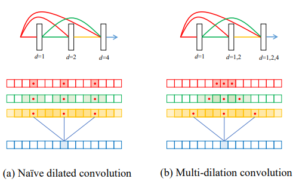
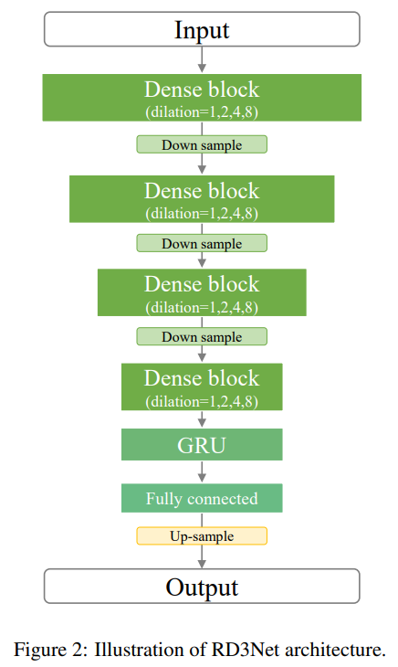
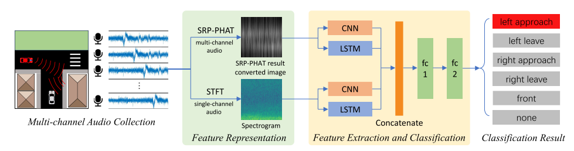
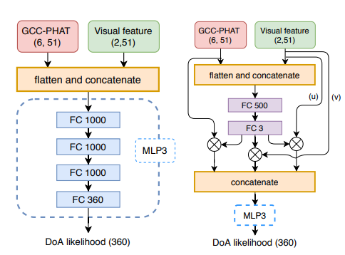
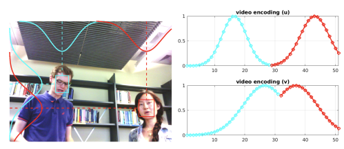
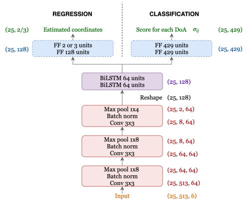

# Literature_Review
## 1. Seeing With Sound:Long-range Acoustic Beamforming for Multimodal Scene Understanding

### Summary:

By combining microphone beamforming information with camera images, target localization under specific conditions (e.g., vehicles) is achieved. Additionally, the author proposes a neural network-based method to optimize the beamforming resolution of the microphone array, enabling higher recognition resolution for more
accurate multi-sensor fusion-based target localization.

### Take Away Information:

1. Sound can help cameras overcome limitations in low-light and partially occluded environments.

2. A neural network can enhance the beamforming resolution of a microphone array, effectively simulating a high-aperture system.

## 2. Direction of Arrival Estimation for Multiple Sound Sources Using Convolutional Recurrent Neural Network

### Summary:

The authors designed a network for sound source localization (direction), combining CNN and RNN methods to predict the direction of the sound source with a better understanding of temporal information. Based on the results shown, the authors successfully achieved accurate prediction for single-source scenarios, but the prediction performance was average when multiple sound sources were present.

### Take Away Information:

1. A new kind of neural network that could be used for sound source localization, this structure could be used in siren detection.

2. Dataset for sound localization training.

3. Combining CNN and RNN structure could extract the direction information from the spectrogram.

## 3. A LEARNING-BASED APPROACH TO DIRECTION OF ARRIVAL ESTIMATION IN NOISY AND REVERBERANT ENVIRONMENTS

### Summary:

The author designed an learning based approach directly learns the nonlinear relationship between the received signals and the DOA from a large amount of trainiing data synthesised for many noisy and reverberant environments. To investigate how to use a big set of ttraining data to achieve reliably DOA estimation in adverse environments. The idea is to learn a mapping from featuress extracted from the microphone array inputs to the DOA using a big set of training data.

### Take Away Information:

1. The DOA estimation is formulated as a 360-class pattern classification problem (0 degrees to 359 degrees).

2. Use GCC feature for DOA estimation: TDOA of microphone pairs are estimated from their GCC vectors but TDOA estimation is often enreliable in low SNR and high reverberation conditions. Also, compared with the raw data from the microphone which only shows the signal from one microphone, GCC always give an information about the relationship between two microphone. 

3. A simple neural network structure with only one hidden layer is used 

4. To improve the robustness of the estimation in noisy environment, we proposed to use a weighted sum of the GCC patterns from all the frames of the test.

5. The performance is tested in small, medium and big  meeting rooms 

## 4. Deep Neural Networks for Multiple Speaker Detection and Localization

### Summary: 

Propose to use neural networks for simultaneous detection and localization of multiple sound sources in human-robot interaction. In contrast to conventional signal processing techniques, neural network-based sound source localization methods require fewer strong assumptions about the environment. Three NN architectures for multiple SSL(Sound Source Localization) are propoesed and NN adopt a likelihood-based output encoding that can handle an arbitrary number of sources.

### Take Away Information:

1. Use generalizaed cross-correlation with phase transform for the input instead a single estimation of the TDOA

2. The speech signals in the time-frequency domain is sparsity and the rrandomly distributed noise which might be stronger than the signal in some TF bins. So the author proposed to use GCC-PHAT on mel-scale filter bank. 

3. The output is encoded into a vector of 360 values, each of which is associated with an individual azimuth direction. The possibility could be zero when there is no sound source or contains N peaks when there are N sources.

4. Three neural network is proposed: 

    (a) Multilayer perceptron with GCC-PHAT

    (b) Convolutional neural network with GCCFB

    (c) Convolutional neural network with GCCFB: first extract the direction information from the delay message within similar frequency region, then extract the possibility of DoA from all-frequency information (The model is shown in the network structure part)

## 5. SOUND EVENT LOCALIZATION AND DETECTION USING ACTIVITY-COUPLED CARTESIAN DOA VECTOR AND RD3NET

### Summary:

A two stage system is proposed to solve the sound event localization and sound event detection task simultaneously using an activity-coupled Cartesian DOA vector representation. During the preprocessing, two data augmentation techniques are applied to input signals prior to the feature extraction while one data augmentation techinique exploiting multichannel information in the feature domain is performed after the feature extraction.

### Take Away Information:

1. Multichannel amplitude spectrograms and inter-channel phase differences are used as frame-wise features

2. Data Augmentation: 

    (a) EMDA: Mix the sound with random amplitudes to simulate a noisy environment

    (b) Rotate: Rotate the sound source (they used a circular microphone layout in the research)

    (c) Multichannel SpecAugment: Extend a channel dimension to the feature map

3. The RD3Net model is adopt from D3Net architecture which is previously used for sound separation, the changes of the model would be compared in the nerual network part. 

4. A binary cross entropy is used for the event detection head and masked MSE is used for DoA detection had.

## 6. D3Net*

### Summary:

The paper ultilize a CNN based nerual network to solve the music sound separation problem. In this work, the author combine the advantages of DenseNet and dilated convolution to propose a novel network architecture.

### Take Away Information: 

1. Propose a nested architecture of dilated dense block to effectively repeat dilation factors multiple times with dense connections that ensure the sufficient depth required for modeling resolution

    

2. Indicate that applying a dilated convolution to skip connections from early layers without handling the aliasing problem makes it difficult to extract information.

## 7. Environmental Sound Classification with CNN

## 8. Deep CNN for Environmental Sound Classification and Data Augmentation

### Summary:

Deep convolutional neural networks (CNNs) are well-suited for environmental sound classification due to their ability to learn discriminative spectro-temporal features. However, the scarcity of labeled data limits their application. This study proposes a deep CNN architecture and audio data augmentation techniques to address this issue. Experiments show that the combination of data augmentation and the proposed CNN achieves state-of-the-art performance, outperforming both the CNN without augmentation and shallow dictionary learning models. Additionally, different augmentation methods affect the classification accuracy of each class differently, suggesting that class-conditional data augmentation could further enhance performance.

### Take Away Information:

1. A deep CNN arhitecture with three convolutional layers interleaved with two pooling operations, followed by two fully connected layers is contrusted for sound classification.

2. Four different kinds of audio data augmentation methods are used:

    (1) Time stretching: slow down or speed up the audio sample 

    (2) Pitch shifting (Greatest Positive Impact): raise or lower the pitch of the audio sample 

    (3) Dynamic range compression: compress the dynamic range of the sample using four parameterizations (What is dynamic range: the sound from a boardingcast and a high-quality speakers is different)

    (4) Background noise: mix the sample with another recording containing background sounds from different types of acoustic scenes

3. The result shows that CNN with augmentation method perform much better than the traditional methods, also it indicates that the superiorperformance of the proposed SB-CNN is not only due to theaugmented training set, but rather thanks to the combinationof an augmented training set with the increased capacity andrepresentational power of the deep learning model.

##  9. Long-range Acoustic Beamforming for Multimodal Scene Understanding

### Summary:

The author introduce long-range acoustic beamforming of sound produced by road users in-the-wild as a complementary sensing modality to traditional electromagnetic radiation-based sensors. With the help of a neural aperture expansion method for beamforming, it shows its effectiveness for multimodal automotive object detection when coupled with RGB images in challenging automotive scenarios.

### Take Away Information:

1. Multimodal signals, combining beamforming and RGB data, are utilized for object detection to enhance detection accuracy.

2. To improve beamforming performance, the author trained a neural network to synthetically expand the microphone array's aperture, enabling higher-fidelity beamforming maps with reduced PSF distortion.

3. Acoustic sensors complement photon-based sensors by detecting incoming objects that are not directly visible to RGB or lidar systems.

## 10. Hearing what you cannot see: Acoustic Vehicle Detection Around Corners

### Summary:

This work proposes to use passive acoustic percep-tion as an additional sensing modality for intelligent vehicles. We demonstrate that approaching vehicles behind blind corners can be detected by sound before such vehicles enter in line-of-sight. We have equipped a research vehicle with a roof-mounted microphone array, and show on data collected with this sensor setup that wall reflections provide information on the presence and direction of occluded approaching vehicles.

### Take Away Information:

1. Sound -> STFT -> Bandpass and Segmentation -> Directional of Arrival -> Classifier

2. An approaching vehicle could be detected with the same accuracy as visual baseline already more than one second ahead. 

3. It has difficulties to perform reliably in unseen test environments. 

## 11. Acoustic Non-Line-of-Sight Vehicle Approaching
and Leaving Detection

### Summary:

This work propose a deep learning-based acoustic non-line-of-sight (NLOS) vehicle detection method. Using direction-of-arrival and time-frequency features from microphone array data, we designed a parallel neural network to predict the direction and approach/leave status of occluded vehicles at intersections. Experiments with urban data showed a 96.71% accuracy for 6-class traffic conditions and detected approaching vehicles 1 second before entering the line of sight, outperforming state-of-the-art methods and providing valuable reaction time and traffic information for intelligent vehicles.

### Take Away Information

1. Except from SRP-PHAT, the author also use spectrogram as an input to explore the application of diverse acoustic features. (time-frequency feature in the spectrogram is effective for the NLOS vehicle approaching and leaving detection)

2. The traffic around the corner is predicted as one of the six categories: front, left approach, left leave, right approach, right leave, none 

3. Use frequency masking and time masking for data augmentation to alleviate the problem of overfitting and the large amount of training data.

4. Leaving is more challenging to detect than the approaching one on the same side, which might be related to the influence of the vehicle's sounding position and body structure on sound propagation.

## 12. Emergency Vehicles Audio Detection and Localization in Autonomous
Driving

### Summary:

The author designed a model to perform three tasks simultaneously, including siren existence, siren sound source direction and siren sound source distance detection, which share a unified backbone consisting of two streams that process the raw waveform and handcraft features separately. In addition, they only employed two general microphone with 8 channel which is no more than 100 dollars.

### Take Away Information:

1. Each microphone has 4 channels located at the front, back, left and right.

2. One stream processes raw waveform and the other processes the combination of Mel-frequency cepstral coeffcients and log-mel spectrogram. 

3. The angle MAE achieve the best performance when the distance is 30 meter, the performance is not good when the distance is too far or too close (both of the sound source are moving). 

## 13. Acoustic-based Emergency Vehicle Detection Using Convolutional Neural Networks

### Summary:

This work develops an automatic detection system for emergency vehicle sirens to alert drivers and reduce accidents, especially when in-vehicle audio systems block siren sounds. The proposed CNN-based model, SirenNet, uses two streams: WaveNet for raw waveforms and MLNet for MFCC and log-mel spectrogram features. Tested on a diverse dataset, SirenNet achieved 98.24% accuracy and maintained 96.89% accuracy with short 0.25-second samples. This system enhances driver safety and supports autopilot systems.

### Take Away Information:

1. To achieve the generality of the detection system, they collect siren signals of emergency vehicles in real-world traffic from many countries.

2. 1D-CNN model (WaveNet) which can automatically learns from raw waveform the useful features for classification.

3. A 2D-Stream(MFCC and Spectrogram) is processed with 2D-CNN.

4. Two stream method could achieve about 2% more accuracy than any one stream method.

## 14. Self-Supervised Moving Vehicle Detection From Audio-Visual Cue

### Summary:

The author propose a self-supervised approach that leverages audio-visual cues to detect moving vehicles. Also a dataset contain over 70 minutes of time-synchronized audio and video recording of vehicles on roads including more than 300 bounding box annotations. 

### Take Away Information:

1. The model has two input: We denote an image and its associated audio segment at time step t as the pair (It, At), where At denotes the concatenated spectrograms ob-tained from the microphone signals temporally centered around the recording time-stamp of the image It

2. The image and video message are encoded in a feature dimension, and a heatmap is the euclidean distance between the each feature vector in the image feature map with the audio feature vector 

3. Separate the sample to Positive and Negative (with or without moving vehicle), then formulate the problem as a binary classification problem.

4. A student net is contrusted with EfficientDet with audio information only

## 15. Towards Robust Audio-Based Vehicle Detection via Importance-Aware Audio-Visual Learning

### Summary:

 In this paper, the author present a new audio-based vehicle detector that can transfer multimodal knowledge of vehicles to the audio modality during training. To this end, they combine the audio-visual modal knowledge according to the importance of each modality to generate integrated audio-visual feature. Also, they introduce an audio-visual distillation (AVD) loss that guides representation of the audio modal fea-ture to resemble that of the integrated audio-visual feature. As a result, our audio-based detector can perform robust vehicle detection.

### Take Away Information:

1. The model will not merely combine audio and visual data; instead, it will assign a weight to each modality based on its relative importance.

2. We introduce an audio-visual distillation loss to perform knowledge distillation from the audio-visual feature to the audio modal feature. 

3. During training, the model leverages both audio and visual information to encode two representations, \(F_a\) (audio) and \(F_{av}\) (audio-visual), which are processed by two shared-weight heads to predict the vehicle's classification and localization. However, during inference, only the audio input is used for localization prediction.

4. The importance of each modality is considered because one modality may perform poorly, requiring the model to assign greater weight to the other.

## 16. Regression versus Classification for Neural Network Based Audio Source Localization

### Summary:

The author compares the performance of regression and classification neural networks for single-source direction-of-arrival (DOA) estimation. Specifically, two regression methods and two encoding methods for classification are presented and analyzed. The results indicate that regression using Cartesian coordinates is generally more accurate, except in scenarios with localized interference.

### Take Away Information:

1. In the regression formulation, the goal is to directly recover an estimate of the azimuth and elevation degree. For the classification formulation, the neural network outputs a score for each class on the discretized unit sphere.

2. Input: a 6-channel normalized intensity vector extracted from first-order Ambisonics format.

3. The neural nework is constructed with CNN and LSTM layers.

4. The label for the classification problem is constructed with Gibbs distribution, and also the Gibbs distribution is integrated with the cross-entropy loss.

5. Classification problem perform better than the regression networks targeting the spherical coordinates, while regression is better for Cartesian coordinates. 

## 17. Multi-Target DoA Estimation with an Audio-Visual Fusion Mechanism

### Summary:

This work proposes the use of neural networks with audio and visual signals for multi-speaker localization. By leveraging heterogeneous sensors, the method aims to overcome challenges associated with single-modal data, such as noise, reverberation, illumination variations, and occlusions. An adaptive weighting mechanism for audio-visual fusion is introduced to address these issues. Additionally, a novel video simulation method is proposed to generate visual features from noisy target 3D annotations, which are synchronized with acoustic features.

### Take Away Information:

1. Only GCC-PHAT is used as the acoustic input feature of the network.

2. The bounding box for the face detection is used as the vision feature, but it is encoded by Gaussian Distribution.

3. The first neural network is consturcted with MLP layers, and it only uses the GCC-PHAT and visual feature as inputs.

4. The second network introduce a adaptive weighting mechanism for the input information, the details could be seen the following model part. 

## 18. Self-supervised Moving Vehicle Tracking with Stereo Sound 

### Summary:

This work presents a system for localizing moving vehicles using stereo sound, without visual input during inference. By leveraging unlabeled audiovisual data, the system employs a vision "teacher" network for vehicle detection and a stereo-sound "student" network for localization. The knowledge from the visual model is transferred to the audio domain through self-supervision, using the co-occurrence of audio and visual streams in unlabeled videos. Experimental results on a new Auditory Vehicle Tracking dataset show that the approach outperforms baseline methods and can improve vehicle localization under poor lighting conditions.

### Take Away Information:

1. A vision detector is first used to detect the objects and a stereo-sound network is trained to map the audio signals to the bounding box coordinates predicted by the vision network.

2. Considering that different camera angles can cause more significant changes to visual content than to audio, the camera's meta-data is also included in the training data.

3. In addition to the loss function for the bounding box, the author also designs an internal loss for the encoding space. The goal is to encourage the audio-net and vision-net to learn similar features.

4. The spectrogram input has a better performance than the raw waveform input.

5. With the help of the camera information in the input, the generalization could be significantly improved, bt still have considerable performance gaps with seen scenarios.

## 19. Review of Emergency Vehicle Detection Techniques by Acoustic Signals

### Take Away Information:

1. With the help of an emergency vehicle detection system: Deal with the problem that modern cars cabin is designed to insulate their inside environment from outside noise and help hearing-impaired people to drive in most of the world

2. Some traditional method like attack-decay-sustain-release analysis could be used on siren analysis

3. A dynamic range compression method could be used to segregate the foreground event

4. A restriction between 500 and 2000 Hz is a common band filter for siren

## 20. Few-Shot Emergency Siren Detection

### Summary:

This paper proposes a few-shot metric learning approach for emergency siren detection, using prototypical networks trained on synthetic or public data. At inference, it identifies ambulance sirens with minimal examples and evaluates performance on recordings from in-car sensors, achieving high AUPRC scores (0.86 unfiltered, 0.91 filtered). The method outperforms convolutional baselines and demonstrates reliability for real-world in-car emergency detection systems.

### Take Away Information:

1. The few-shot leaning first embed the large-dimension information to an embedding space with low dimension, then it is easy for the model to learn the feature in the low dimension space.

2. Use few channels to train the way-shot model -> use the model on all the channels

## 21. The Audio-Visual BatVision Dataset for Research on Sight and Sound

### Summary:

The BatVision dataset was created to advance research in robot echolocation and audiovisual tasks by providing large-scale real-world echo data. It consists of synchronized RGB-D images and binaural microphone recordings of chirping sounds in diverse environments, from modern US office spaces to historic French university grounds. This dataset enables exploration of sound-based depth prediction and other audio-visual phenomena that are not possible with simulated data. Initial results show promising performance in audio-only depth prediction, demonstrating the potential of the dataset for real-world applications.

### Take Away Information:

1. Depth-from-stereo algorithms produce artifacts in low-light conditions and when objects lack textures. Combiining audio-visual information can improve task performance with one modality providing labels for the other. 

2. A speaker was used to emitted chirps while two USB microphones embedded into silicone ears are used to record the echoes.

3. A U-Net was trained and achieved a solid results, correctly predicting free space, obstacles and the general room layout.

## 22. Detecting the direction of emergency vehicle sirens with microphones

### Summary:

Sound is particularly im-portant in cases involving Emergency Vehicle (EV) sirens, horn, shouts, accident noise, a vehicle approaching from a sharp corner, poor visibility, and other instances where there is no direct line of sight or it is limited. In this work the Direction of Arrival (DoA) of an EV is detected using microphone arrays. The decision of an Autonomic Vehi-cle (AV) whether to yield to the EV is then dependent on the estimated DoA.

### Take Away Information

1. The author employed a MUSIC (Multiple Signal Classification) algorithm for DoA estimation. Similar to beamforming, MUSIC analyzes the eigenvectors of the autocorrelation matrix of the microphone array and evaluates the alignment between potential directions and the observed sound.

2. Using just four external microphones is sufficient to detect the sound of a siren through geometric methods. However, relying on internal microphones is less effective due to reflections and the car's non-free-field acoustic environment.

## 23. Dual input neural networks for positional sound source localization

### Summary:

The paper introduces Dual Input Neural Networks (DI-NNs) for sound source localization (SSL), which combine high-dimensional multichannel audio signals and acoustic scene metadata, such as microphone coordinates. The DI-NN is trained and evaluated on various scenarios and compared with classical methods, including Least-Squares (LS) and Convolutional Recurrent Neural Networks (CRNN). Results show that DI-NN significantly outperforms the baselines, achieving five times lower error rates.

### Take Away Information:

1. The author introduces the DI-NN neural network architecture which is capable of processing high-dimensional signals, namely spectrograms, along with a relevant metadata vector of lower dimensionality.

2. The metadata is the concatenation of the coordinates of the microphones, the room dimensions and reverberation time.

3. The neural network is divided to three parts: feature extraction network (extract the information from the spectrogram), metadata embedding network (extract the information from the metadata), metadata fusion network (fuse the information from the metadata and the audio data)

4. The author didn't use a spectrogram as an input, instead, he split the real and imaginary parts of the STFT and put them in the input. A raw data will always give more information. 

5. A two layer fully connected nn is used for extracting the features from the metadata, and a CRNN structure is used for the audio data.

6. CNN is used to combine the local information and reduce the dimensionality, and GRU-RNN is used to propagare location information to silent time-steps

7. The source of the sound is randomly placed in the room, and the place of the microphone is also changing during the data collection.

## 24. Binaural SoundNet: Predicting Semantics, Depth and Motion with Binaural sounds

### Summary:

This work focuses on scene understanding using binaural sounds, aiming to predict semantic masks, object motion, and depth maps purely from audio. A novel sensor setup, combining eight binaural microphones and a 360° camera, is used to create a new audio-visual street scene dataset. A cross-modal distillation framework trains a sound-based model using visual methods as "teachers," eliminating the need for human annotations. Additionally, a Spatial Sound Super-Resolution task improves directional sound resolution. An end-to-end multi-task network is developed to enhance performance across all tasks.

### Take Away Information:

1. The author try to use the acoustic features on three scene understanding tasks: semantic prediction, depth prediction and motion prediction based on binaural sounds

2. Humans localize sounds using three cues: ITD (time difference), ILD (level difference), and HRTF (frequency changes by the pinna and head).

3. Except from the spectrogram, another differential digital signal processing method feature is also included.

4. A joint training of the 4 tasks is beneficial to the semantic prediction task.

5. ASPP is a powerful encoder for audio.

## 25. HDMapNet: An Online HD Map Construction and Evaluation Framework

### Summary:

This paper introduces **HDMapNet**, a method for scalable HD semantic map learning using onboard sensors like cameras and LiDAR. HDMapNet predicts vectorized map elements in bird's-eye view, outperforming baselines by over 50% on the nuScenes dataset. New metrics are proposed to evaluate performance, and the method demonstrates the ability to predict locally consistent maps, addressing the challenges of traditional manual annotation pipelines.

### Take Away Information:

1. The model takes the camera image and lidar points as input and outputs vectorized map elements

2. A neural view transformer is used to transform image features from perspective view to camera coordinates

3. The point cloud is aggregated to pillars

4. The BEV decoder is a fully convolutional network with 3 branches, for semantic segmentation, instance embedding and direction prediction branch.

## 26. There is More than Meets the Eye: Self-Supervised Multi-Object Detection and

### Summary:

This work introduces MM-DistillNet, a self-supervised framework that leverages multiple modalities (RGB, depth, and thermal) to distill knowledge into an audio-based network. It uses a new loss function and self-supervised tasks to eliminate manual annotations. The method enables robust multi-object detection using only sound, even with a moving camera, addressing limitations of prior approaches reliant on RGB images.

### Take Away Information:

1. RGB, depth, and theramal are used as input 

2. The network transfer the knowledge from the intermediatee layers through an alignment loss function and it aligns the features of the intermediate teacher-student layers using a probabilistic approach

3. EfficientNet is used for the encoder for all the four inputs 

4. A first taks is try to learn how many cars are shown in the surrounding environment 

5. Two loss function are used for the optimization, the first one is the focal loss which gives a loss function to the position and the size of the bounding box, and the other one is the mta loss which compares the different bounding boxes got by different teachers.

# Network Structure

## 1. Seld Net (DoA (Multi) Sound Source Estimation)

    

### Input 

Spectrogram with 40 ms Hamming window and 50% overlap, each containing 1024 magnitude and phase value: L\*1024\*2C (L=100 -> 2s)

### Spatial Pseudo-spectrum Phase

<table align="center">
  <tr>
    <td>Layer</td>
    <td>Dimension</td>
  </tr>
  <tr>
    <td>Raw Data</td>
    <td>100*1024*2C</td>
  </tr>
  <tr>
    <td>4 Convolution Layers</td>
    <td>100*2*64</td>
  </tr>
  <tr>
    <td>Concatenate</td>
    <td>100*128</td>
  </tr>
  <tr>
    <td>2 Bidirectional GRU Layers</td>
    <td>100*128</td>
  </tr>
  <tr>
    <td>1 Linear Layer</td>
    <td>100*614</td>
  </tr>
</table>

### Direction of Arrival Phase

<table align="center">
  <tr>
    <td>Layer</td>
    <td>Dimension</td>
  </tr>
  <tr>
    <td>SPS</td>
    <td>100*614</td>
  </tr>
  <tr>
    <td>Reshape</td>
    <td>100*614*1</td>
  </tr>
  <tr>
    <td>2 Convolution Layers</td>
    <td>100*307*16</td>
  </tr>
  <tr>
    <td>Concatenate and 1 Linear Layer</td>
    <td>100*32</td>
  </tr>
  <tr>
    <td>2 Bidirectional GRU Layers</td>
    <td>100*32</td>
  </tr>
  <tr>
    <td>1 Linear Layer</td>
    <td>100*432</td>
  </tr>
</table>

## 2. MLP based DoA estimator

    

### Input 

A 28×21 GCC graph, where 28 represents 28 microphone pairs and 21 indicates the 21 time delay samples selected for calculation for each pair of microphones. In addition, some weights are added to the input to make the model robust to the noise.

    

### Output

The posterior probability of a DOA angle is p(θt|ot) for θt = 0, ..., 359 degrees.

## 3. Convolutional neural network with GCCFB

    

### Preprocessing

**GCCFB**: it works by decomposing the signal into multiple mel-scale frequency bands (which are well-suited to the spectral characteristics of speech), and then calculating GCC-PHAT for each frequency band separately. This helps to preserve delay information for each frequency band.

### Input 

51 * 40 * 6 GCCFB graph

### Output

The same output as the MLP based DoA neural network

## 4. Two-stage neural network with GCCFB

    

### Subnet I

Time delay feature space to  degree feature: extract latent DoA features in each fiter bank  on individual frequency regions.

### Subnet II

The second stage aggregates information across all frequencies in a neighbor DoA area and outputs the likelihood of a sound being in each DoA area.

## 5. RD3Net

    

### Input

Multichannel amplitude spectrograms and inter-channel phase differencees are used as frame-wised features. The STFT was applied with a configuration of 20 ms frame length and 10 ms frame hop.

### Output

The name of the sound event and source angle.

## 6. SB-CNN (Sound Classification Neural Network)

<table align="center">
  <tr>
    <td>Layer</td>
    <td>Size</td>
  </tr>
  <tr>
    <td>Conv1</td>
    <td>24*5*5</td>
  </tr>
  <tr>
    <td>Conv2</td>
    <td>48*5*5</td>
  </tr>
  <tr>
    <td>Conv3</td>
    <td>48*5*5</td>
  </tr>
  <tr>
    <td>Linear Layer</td>
    <td>64</td>
  </tr>
  <tr>
    <td>Linear Layer</td>
    <td>10</td>
  </tr>
  <tr>
    <td>Softmax</td>
    <td>10</td>
  </tr>
</table>

### Input 

Time-frequency patches taken from the log-scaled mel-spectrogram representation of the audio signal. The spectrogram is extracted with 128 components covering the audible frequency range (0-22050 Hz), using a window size of 23 ms.

### Output

Possibility of the related class 

## 7. NLOS vehicle approaching and leaving detection system

    

### Input

A sound split with a selected sample duration is processed to a SRP-PHAT(x axis is time and y axis is the potential azimuth angle that the sound comes) and STFT 

### Output

A classification result for the state of the car behind the corner: SRP-PHAT and STFT are processed separately, with SRP-PHAT playing a crucial role in direction detection, while STFT provides Doppler information, essential for identifying whether the car is approaching or leaving.

## 8. Multi-Target DoA Estimation with Audio-Visual Fusion Mechanism

    

### Input 

Both visual and acoustic features are used as inputs. The acoustic information is encoded into a GCC-PHAT feature, which captures the relationship between different microphones. For the visual information, the bounding box from the face detection is encoded into two vectors representing the height and width dimensions, as shown in the figure below.

    

### Structure

The structure of the neural network is straightforward. The key difference between the two networks is that the second network concatenates both the raw data and the processed data before making the prediction.

### Output

The same output as the MLP based DoA neural network

## 9. Classification versus Regression NN

    

### Input:

The STFT feature is used as an input, during the processing 3 conv layers and 2 LSTM layers are used to handle the features.

### Output:

Two linear layers are used to decode the features into the outputs: the regression output represents the angle of the sound, while the classification output represents the probability of the sound occurring at a specific angle.

# Other Knowledge

## GCC: Generalized Cross Correlation

GCC is used to estimate the time delay between two microphone, where \( 𝜏 \) is the delay in the discrete domain, \( * \) denotes the complex conjugation, and \( R \) denotes the real part of a complex number. The peak in GCC-PHAT is used to estimate the TDOA.

    

For example, if the correlation coefficient reaches its highest value when 𝜏 = 0 it indicates that there is no time delay between the two signals.

