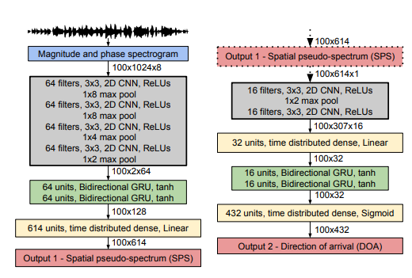
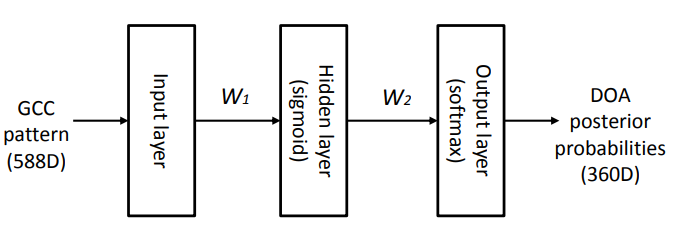
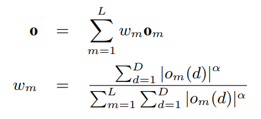
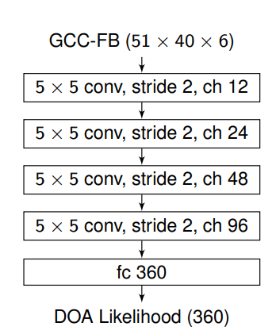
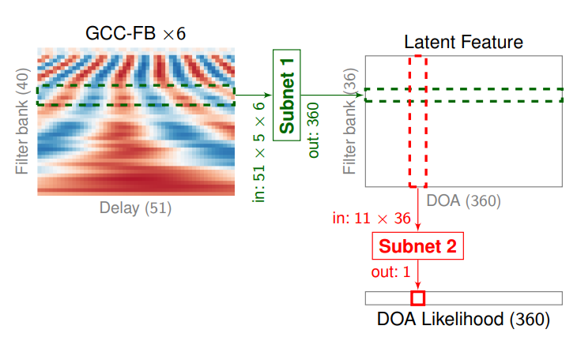
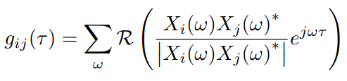

# Literature_Review
## 1. Seeing With Sound:Long-range Acoustic Beamforming for Multimodal Scene Understanding

### Summary:

By combining microphone beamforming information with camera images, target localization under specific conditions (e.g., vehicles) is achieved. Additionally, the author proposes a neural network-based method to optimize the beamforming resolution of the microphone array, enabling higher recognition resolution for more
accurate multi-sensor fusion-based target localization.

### Take Away Information:

1. Sound can help cameras overcome limitations in low-light and partially occluded environments.

2. A neural network can enhance the beamforming resolution of a microphone array, effectively simulating a high-aperture system.

## 2. Direction of Arrival Estimation for Multiple Sound Sources Using Convolutional Recurrent Neural Network

### Summary:

The authors designed a network for sound source localization (direction), combining CNN and RNN methods to predict the direction of the sound source with a better understanding of temporal information. Based on the results shown, the authors successfully achieved accurate prediction for single-source scenarios, but the prediction performance was average when multiple sound sources were present.

### Take Away Information:

1. A new kind of neural network that could be used for sound source localization, this structure could be used in siren detection.

2. Dataset for sound localization training.

3. Combining CNN and RNN structure could extract the direction information from the spectrogram.

## 3. A LEARNING-BASED APPROACH TO DIRECTION OF ARRIVAL ESTIMATION IN NOISY AND REVERBERANT ENVIRONMENTS

### Summary:

The author designed an learning based approach directly learns the nonlinear relationship between the received signals and the DOA from a large amount of trainiing data synthesised for many noisy and reverberant environments. To investigate how to use a big set of ttraining data to achieve reliably DOA estimation in adverse environments. The idea is to learn a mapping from featuress extracted from the microphone array inputs to the DOA using a big set of training data.

### Take Away Information:

1. The DOA estimation is formulated as a 360-class pattern classification problem (0 degrees to 359 degrees).

2. Use GCC feature for DOA estimation: TDOA of microphone pairs are estimated from their GCC vectors but TDOA estimation is often enreliable in low SNR and high reverberation conditions. Also, compared with the raw data from the microphone which only shows the signal from one microphone, GCC always give an information about the relationship between two microphone. 

3. A simple neural network structure with only one hidden layer is used 

4. To improve the robustness of the estimation in noisy environment, we proposed to use a weighted sum of the GCC patterns from all the frames of the test.

5. The performance is tested in small, medium and big  meeting rooms 

## 4. Deep Neural Networks for Multiple Speaker Detection and Localization

### Summary: 

Propose to use neural networks for simultaneous detection and localization of multiple sound sources in human-robot interaction. In contrast to conventional signal processing techniques, neural network-based sound source localization methods require fewer strong assumptions about the environment. Three NN architectures for multiple SSL(Sound Source Localization) are propoesed and NN adopt a likelihood-based output encoding that can handle an arbitrary number of sources.

### Take Away Information:

1. Use generalizaed cross-correlation with phase transform for the input instead a single estimation of the TDOA

2. The speech signals in the time-frequency domain is sparsity and the rrandomly distributed noise which might be stronger than the signal in some TF bins. So the author proposed to use GCC-PHAT on mel-scale filter bank. 

3. The output is encoded into a vector of 360 values, each of which is associated with an individual azimuth direction. The possibility could be zero when there is no sound source or contains N peaks when there are N sources.

4. Three neural network is proposed: 

    (a) Multilayer perceptron with GCC-PHAT

    (b) Convolutional neural network with GCCFB

    (c) Convolutional neural network with GCCFB: first extract the direction information from the delay message within similar frequency region, then extract the possibility of DoA from all-frequency information (The model is shown in the network structure part)

# Network Structure

## 1. Seld Net (DoA (Multi) Sound Source Estimation)

    

### Input 

Spectrogram with 40 ms Hamming window and 50% overlap, each containing 1024 magnitude and phase value: L\*1024\*2C (L=100 -> 2s)

### Spatial Pseudo-spectrum Phase

<table align="center">
  <tr>
    <td>Layer</td>
    <td>Dimension</td>
  </tr>
  <tr>
    <td>Raw Data</td>
    <td>100*1024*2C</td>
  </tr>
  <tr>
    <td>4 Convolution Layers</td>
    <td>100*2*64</td>
  </tr>
  <tr>
    <td>Concatenate</td>
    <td>100*128</td>
  </tr>
  <tr>
    <td>2 Bidirectional GRU Layers</td>
    <td>100*128</td>
  </tr>
  <tr>
    <td>1 Linear Layer</td>
    <td>100*614</td>
  </tr>
</table>

### Direction of Arrival Phase

<table align="center">
  <tr>
    <td>Layer</td>
    <td>Dimension</td>
  </tr>
  <tr>
    <td>SPS</td>
    <td>100*614</td>
  </tr>
  <tr>
    <td>Reshape</td>
    <td>100*614*1</td>
  </tr>
  <tr>
    <td>2 Convolution Layers</td>
    <td>100*307*16</td>
  </tr>
  <tr>
    <td>Concatenate and 1 Linear Layer</td>
    <td>100*32</td>
  </tr>
  <tr>
    <td>2 Bidirectional GRU Layers</td>
    <td>100*32</td>
  </tr>
  <tr>
    <td>1 Linear Layer</td>
    <td>100*432</td>
  </tr>
</table>

## 2. MLP based DoA estimator

    

### Input 

A 28×21 GCC graph, where 28 represents 28 microphone pairs and 21 indicates the 21 time delay samples selected for calculation for each pair of microphones. In addition, some weights are added to the input to make the model robust to the noise.

    

### Output

The posterior probability of a DOA angle is p(θt|ot) for θt = 0, ..., 359 degrees.

## 3. Convolutional neural network with GCCFB

    

### Preprocessing

## 4. Two-stage neural network with GCCFB

    

# Other Knowledge

## GCC: Generalized Cross Correlation

GCC is used to estimate the time delay between two microphone, where \( 𝜏 \) is the delay in the discrete domain, \( * \) denotes the complex conjugation, and \( R \) denotes the real part of a complex number. The peak in GCC-PHAT is used to estimate the TDOA.

    

For example, if the correlation coefficient reaches its highest value when 𝜏 = 0 it indicates that there is no time delay between the two signals.

